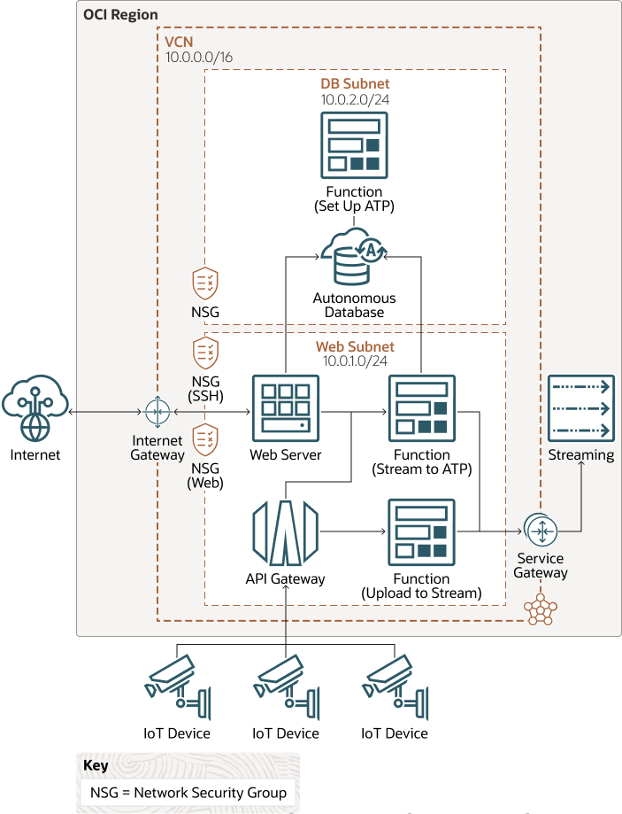

# terraform-oci-arch-iot-streaming

Deploy Oracle Cloud Infrastructure Streaming to support IoT devices data streams uploaded into the cloud at scale.

## Prerequisites

- Permission to `manage` the following types of resources in your Oracle Cloud Infrastructure tenancy: `vcns`, `internet-gateways`, `route-tables`, `network-security-groups`, `subnets`, `stream`, `stream-pull`, `stream-push`, `functions-family`, `autonomous-database-family`, and `instances`.

- Quota to create the following resources: 1 VCN, 2 subnets, 1 Internet Gateway, 1 NAT Gateway, 1 Service Gateway, 2 route rules, 1 ATP database instance, 1 stream/stream pool, 2 Fn App, 3 Fn Functions, 1 APIGateway, and 1 compute instance.

If you don't have the required permissions and quota, contact your tenancy administrator. See [Policy Reference](https://docs.cloud.oracle.com/en-us/iaas/Content/Identity/Reference/policyreference.htm), [Service Limits](https://docs.cloud.oracle.com/en-us/iaas/Content/General/Concepts/servicelimits.htm), [Compartment Quotas](https://docs.cloud.oracle.com/iaas/Content/General/Concepts/resourcequotas.htm).

## Deploy Using Oracle Resource Manager

1. Click [](https://cloud.oracle.com/resourcemanager/stacks/create?region=home&zipUrl=https://github.com/oracle-devrel/terraform-oci-arch-iot-streaming/releases/latest/download/terraform-oci-arch-iot-streaming-stack-latest.zip)

    If you aren't already signed in, when prompted, enter the tenancy and user credentials.

2. Review and accept the terms and conditions.

3. Select the region where you want to deploy the stack.

4. Follow the on-screen prompts and instructions to create the stack.

5. After creating the stack, click **Terraform Actions**, and select **Plan**.

6. Wait for the job to be completed, and review the plan.

    To make any changes, return to the Stack Details page, click **Edit Stack**, and make the required changes. Then, run the **Plan** action again.

7. If no further changes are necessary, return to the Stack Details page, click **Terraform Actions**, and select **Apply**. 

## Deploy Using the Terraform CLI

### Clone the Module
Now, you'll want a local copy of this repo. You can make that with the commands:

    git clone https://github.com/oracle-devrel/terraform-oci-arch-iot-streaming.git
    cd terraform-oci-arch-iot-streaming
    ls

### Prerequisites
First off, you'll need to do some pre-deploy setup for Docker and Fn Project inside your machine:

```
sudo su -
yum update
yum install yum-utils
yum-config-manager --enable *addons
yum install docker-engine
groupadd docker
service docker restart
usermod -a -G docker opc
chmod 666 /var/run/docker.sock
exit
curl -LSs https://raw.githubusercontent.com/fnproject/cli/master/install | sh
exit
```

### Set Up and Configure Terraform

1. Complete the prerequisites described [here](https://github.com/cloud-partners/oci-prerequisites).

2. Create a `terraform.tfvars` file, and specify the following variables:

```
# Authentication
tenancy_ocid         = "<tenancy_ocid>"
user_ocid            = "<user_ocid>"
fingerprint          = "<finger_print>"
private_key_path     = "<pem_private_key_path>"

# Region
region = "<oci_region>"

# Compartment
compartment_ocid = "<compartment_ocid>"

# Availablity Domain 
availablity_domain_name = "availablity_domain_name" # for example "GrCH:US-ASHBURN-AD-1"

# ATP passwords
atp_admin_password = "<ATP_admin_password>"
atp_password = "<ATP_appuser_password>"

# OCIR for functions
ocir_user_name         = "<oci_user_name>"
ocir_user_password     = "<oci_user_auth_token>"

````

### Create the Resources
Run the following commands:

    terraform init
    terraform plan
    terraform apply

### Destroy the Deployment
When you no longer need the deployment, you can run this command to destroy the resources:

    terraform destroy

## Deploy as a Module
It is possible to utilize this repository as remote module, providing the necessary inputs:

```
module "oci-arch-iot-streaming" {
  source             = "github.com/oracle-devrel/terraform-oci-arch-iot-streaming"
  tenancy_ocid       = "<tenancy_ocid>"
  user_ocid          = "<user_ocid>"
  fingerprint        = "<user_ocid>"
  region             = "<oci_region>"
  private_key_path   = "<private_key_path>"
  compartment_ocid   = "<compartment_ocid>"
  atp_admin_password = "<atp_admin_password>"
  atp_password       = "<atp_password>"
  ocir_user_name     = "<ocir_user_name>"
  ocir_user_password = "<ocir_user_password>"
}
```

## How to verify the environment after deployment

1. Use Postman or any other similar tool to populate Streaming with new message. It will be achieved by Upload2StreamFn function exposed via API Gateway (use Upload2StreamFn_POST_EndPoint_URL output):


2. Verify in OCI Console that Stream has been populated with new message:


3. Access Flask Webpage on the compute to check initial state of records for ATP's IoT table (use Flask_Webserver_URL output):


4. Click on "Stream2ATPFn" button on Flask Webpage. It will invoke Stream2ATPFn function that will consume messages from Stream and will push it into ATP IoT table (for the first time you should wait 30-45 seconds as function need to be bootstrapped):


5. Refresh the page and you should see new record visible from ATP perspective:


## Destroy the Deployment
When you no longer need the deployment, you can run this command to destroy it:

    terraform destroy

## Architecture Topology Diagram



## Reference Architecture

This reference architecture deploys OCI Streaming supported by OCI Functions and OCI API Gateway. Messages uploaded to the stream partition will be then consumed by the Functions and uploaded to OCI ATP Instance. Data from the database will be exposed via Flask-based webserver deployed on OCI compute instance.  

For details of the architecture, see [_Stream IoT data to an autonomous database using serverless functions_](https://docs.oracle.com/en/solutions/iot-streaming-oci)

## Contributing
This project is open source.  Please submit your contributions by forking this repository and submitting a pull request!  Oracle appreciates any contributions that are made by the open source community.

### Attribution & Credits
Initially, this project was created and distributed in [GitHub Oracle QuickStart space](https://github.com/oracle-quickstart/oci-arch-iot-streaming). For that reason, we would like to thank all the involved contributors enlisted below:
- Lukasz Feldman (https://github.com/lfeldman)
- Kumar Dhanagopal (https://github.com/kumar-dhanagopal)

## License
Copyright (c) 2024 Oracle and/or its affiliates.

Licensed under the Universal Permissive License (UPL), Version 1.0.

See [LICENSE](LICENSE) for more details.
